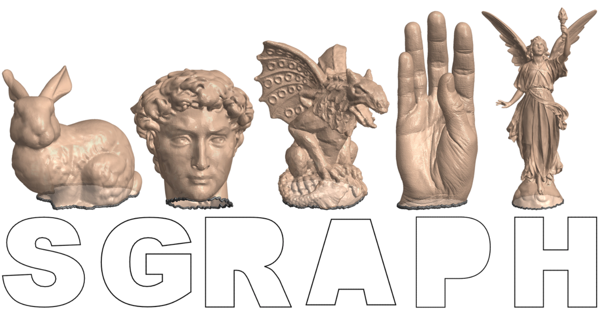

# Locally-Injective-Mappings-Benchmark

Injectively mapping a source mesh into a target domain is an important but challenging task in computer graphics and geometry processing. We publish this dataset as a benchmark for this task. The dataset contains 11647 triangle and tetrahedron source meshes, as well as their target domains. The method in our paper [Lifting Simplices to Find Injectivity](https://duxingyi-charles.github.io/publication/lifting-simplices-to-find-injectivity/) is able to compute locally injective mappings for all the meshes in the dataset. We also publish these results with the dataset. We believe this is the first dataset for locally injective mapping at this scale, and hope it will help future research in this area.

This dataset is not limited to locally injective mapping, you may also find it useful for mesh parameterization, deformation, or simply as a source for a large number of meshes.

## Dataset organization

The dataset contains 10743 triangle mesh examples and 904 tetrahedron mesh examples. They are divided into 3 categories, 2D parameterization, 3D parameterization and 3D deformation. Each category has 3 groups of examples. The following table shows the number of examples in each group.

### 2D Parameterization

#### Simple



#### Letters

#### Liu 

### 3D Parameterization

### 3D Deformation

## Data format

## Cite

If you use our dataset, please cite our paper:
