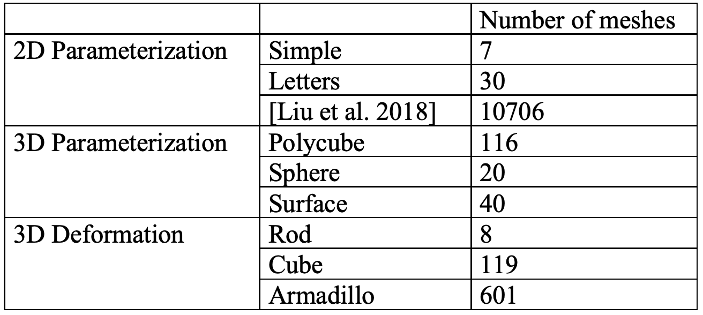
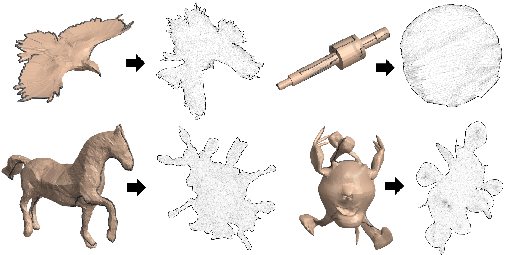

# Locally-Injective-Mappings-Benchmark

Injectively mapping a source mesh into a target domain is an important but challenging task in computer graphics and geometry processing. We publish this dataset as a benchmark for this task. The dataset contains 11647 triangle and tetrahedron source meshes, as well as their target domains. The method in our paper [Lifting Simplices to Find Injectivity](https://duxingyi-charles.github.io/publication/lifting-simplices-to-find-injectivity/) is able to compute locally injective mappings for all the meshes in the dataset. We also publish these results with the dataset. We believe this is the first dataset for locally injective mapping at this scale and hope it will help future research in this area.

This dataset is not limited to locally injective mapping, you may also find it useful for mesh parameterization, deformation, or simply as a source for a large number of meshes.

Download:
[](https://doi.org/10.5281/zenodo.3827969)


## Dataset organization

The dataset contains 10743 triangle mesh examples and 904 tetrahedron mesh examples. They are divided into 3 categories, 2D parameterization, 3D parameterization and 3D deformation. Each category has 3 groups of examples. The following table shows the number of examples in each group.



Next, we will show several examples from each category and discuss how we build the dataset. In all the figures, the injective meshes in target domains are obtained using our method.

### 2D Parameterization

The simple example maps a planar mesh into a planar target domain. The first two examples map a square into two concave domains. The middle two examples come from [Weber & Zorin 2014]. The last three examples are created by rotating and translating the inner boundary.


The 30 letter examples are created by mapping 5 surface meshes into 6 letters from "SIGGRAPH". Letter "I" is not included because it is a convex domain and an injective mapping can be easily generated using Tutte embedding.


For a large portion of 2D parameterization examples, we use the disk-topology surface meshes published in [Liu et al. 2018] as source meshes. The target domains are computed using [Scaffold-map](https://github.com/jiangzhongshi/Scaffold-Map) [Jiang et al. 2017].



### 3D Parameterization

This category includes 116 polycube embedding problems from [Aigerman and Lipman 2013; Fu et al. 2016], 20 spherical mapping and 40 free-surface mapping problems from [Su et al. 2019]


### 3D Deformation

Simulating physical deformation often yields severely distorted meshes for which it is challenging to avoid inversion. Hence, they provide an excellent test set for a method’s ability to recover from inverted elements. We capture frames from non-inverting simulations of twisting, generated by [Li et al. 2020], starting from a rest shape and then twisting it to introduce increasing levels of distortion. For each simulation we embed the starting mesh to the boundary surface of each successive frame, obtaining examples with generally increasing challenge. This category includes 728 examples from deforming a rod, a cube, and the armadillo.


## Data format

Each triangle mesh example contains
- `input.obj`: rest mesh and initial mesh (as uv coordinates)
- `handles.txt`: list of indices of the fixed vertices
- `result.obj`: result of our method

Each tetrahedron mesh example contains
- `rest.vtk`: rest mesh
- `init.vtk`: initial mesh
- `handles.txt`: list of indices of the fixed vertices
- `result.vtk`: result of our method

Here is an introduction to [VTK format](https://lorensen.github.io/VTKExamples/site/VTKFileFormats/).


## Cite

If you use our dataset, please cite our paper
```
@article{DU2020_lifting_injective,
    author = {Xingyi Du and Noam Aigerman and Qingnan Zhou and Shahar Z. Kovalsky and Yajie Yan and Danny M. Kaufman and Tao Ju},
    title = {Lifting Simplices to Find Injectivity},
    journal = {ACM Transactions on Graphics},
    year = {2020},
    volume = {39},
    number = {4}
}
```

## References

- Aigerman, N., & Lipman, Y. (2013). Injective and bounded distortion mappings in 3D. ACM Trans. Graph., 32, 106:1-106:14.
- Fu, X., Bai, C., & Liu, Y.P. (2016). Efficient Volumetric PolyCube-Map Construction. Comput. Graph. Forum, 35, 97-106.
- Li, M., Ferguson, Z., Langlois, T.J., & Jiang, C. (2020). Incremental Potential Contact: Intersection- and Inversion-free, Large-Deformation Dynamics.
- Liu, L., Ye, C., Ni, R., & Fu, X. (2018). Progressive parameterizations. ACM Transactions on Graphics (TOG), 37, 1 - 12.
- Jiang, Z., Schaefer, S., & Panozzo, D. (2017). Simplicial complex augmentation framework for bijective maps. ACM Transactions on Graphics (TOG), 36, 1 - 9.
- Su, J., Fu, X., & Liu, L. (2019). Practical Foldover-Free Volumetric Mapping Construction. Comput. Graph. Forum, 38, 287-297.
- Weber, O., & Zorin, D. (2014). Locally injective parametrization with arbitrary fixed boundaries. ACM Trans. Graph., 33, 75:1-75:12.
